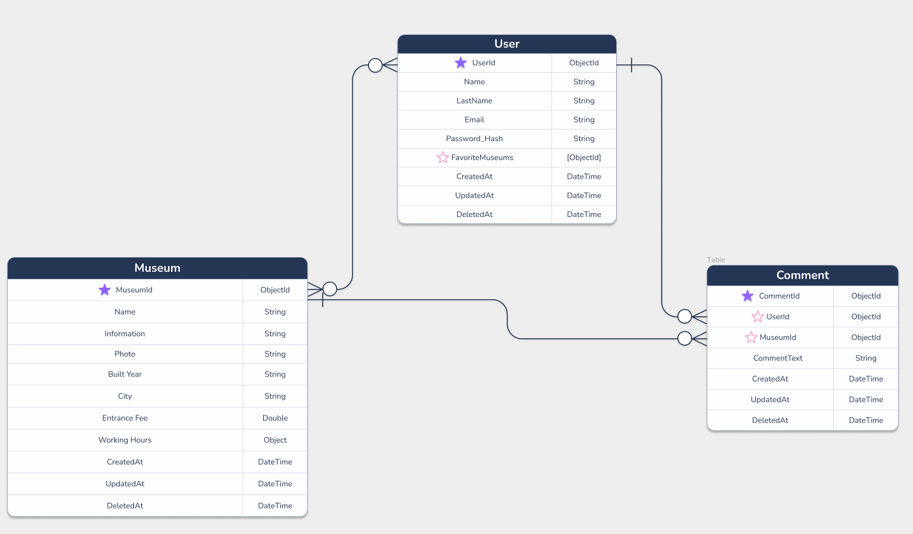

# Museum App API

CRUD application for the museums in Turkey.

<!-- ABOUT THE PROJECT -->
## About The Project

Museum App API is a RESTful API that includes the backend logic of the application. This project came to the life while I was talking to my friend about his final project at a BootCamp. He told me that he could not find a good API for the museums in Turkey and I thought maybe I can build one. It is built on top of the [TypeScript](https://www.typescriptlang.org/), the [Express.js](https://expressjs.com/) framework, the [MongoDB](https://www.mongodb.com/) database.

#### Live Demo Link (Heroku)
https://ronchon-gerard-51245.herokuapp.com/

#### Google Sign In
https://ronchon-gerard-51245.herokuapp.com/google-sign

## Database Diagram



<!-- GETTING STARTED -->

## Getting Started


### Installation

1. Clone the repo
   ```sh
   git clone https://github.com/mehmetfatiherdem/museum-app.git
   ```
2. Navigate to the project folder

   ```sh
   cd museum-app
   ```

3. Install dependencies
   ```sh
   npm i
   ```
4. Run the project
   ```sh
   npm run dev
   ```
5. Run checks and tests
   ```sh
   npm test
   ```

## Features

- CSV import for museums
- List museums
- CRUD operations for museums
- Filter museums by their city
- Register/Login
  - Allow Google, Classic
- Authentication
  - JWT

### Built With

- [Node.js](https://nodejs.org/en/)
- [TypeScript](https://www.typescriptlang.org/)
- [Express.js](https://expressjs.com/)
- [MongoDB](https://www.mongodb.com/)
- [ESLint](https://eslint.org/)
- [Heroku](https://www.heroku.com/)
- [Swagger](https://swagger.io/)
- [Mocha](https://mochajs.org/)
